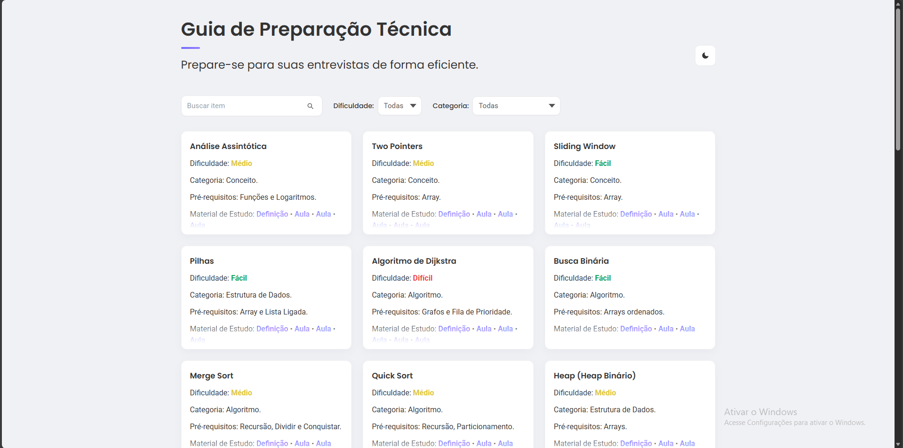

# Guia de Preparação Técnica

**Um guia enxuto e prático para estudar algoritmos e estruturas para entrevistas técnicas.**



**Acessar:** [LINK DO PROJETO](https://washtdev.github.io/guia-entrevistas-tecnicas/)

**Resumo**
- Projeto pensado para centralizar conceitos, algoritmos e estruturas de dados relevantes em entrevistas técnicas.
- Interface limpa, busca rápida e filtros por dificuldade e categoria para chegar no conteúdo certo em segundos.

**Principais Recursos**
- **Busca:** pesquisa por nome, descrição, tags, pré-requisitos e materiais (instantâneo).
- **Filtro:** por **Dificuldade** (Fácil / Médio / Difícil) e **Categoria** (Conceito / Algoritmo / Estrutura de Dados).
- **Dark Mode:** botão para alternar entre tema claro e escuro (persistência via localStorage).
- **Back to Top:** botão fixo para voltar ao topo da página com scroll suave.
- **Ícones sociais:** GitHub e LinkedIn com links clicáveis.
- **Dados estruturados:** o arquivo `data.json` contém itens com `nome`, `dificuldade`, `categoria`, `prerequisitos`, `definicao`, `aulas`, `exercicios`, `descricao` e `tags` — já populado com 25+ temas.

**Tecnologias**
- HTML, CSS (variáveis, temas), JavaScript (fetch, DOM, localStorage).

**Como executar (local)**
1. Abra uma linha de comando no diretório do projeto (`c:\Users\m\workspace\guia-de-preparacao-tecnica`).
2. Sirva localmente (exemplo com Python):

```powershell
python -m http.server 8000
```

3. Abra `http://localhost:8000` no navegador.

**Observações & Créditos**
- Projeto desenvolvido durante a **Imersão Dev (Alura) com o Google** como exercício prático.
- Usei **inteligência artificial** para acelerar partes do fluxo — especialmente na estilização e na população do arquivo `data.json` (conteúdo e links iniciais).
- Este repositório foi projetado para ser simples de estender: acrescente itens em `data.json`, adicione aulas/exercícios e o front renderiza automaticamente.
